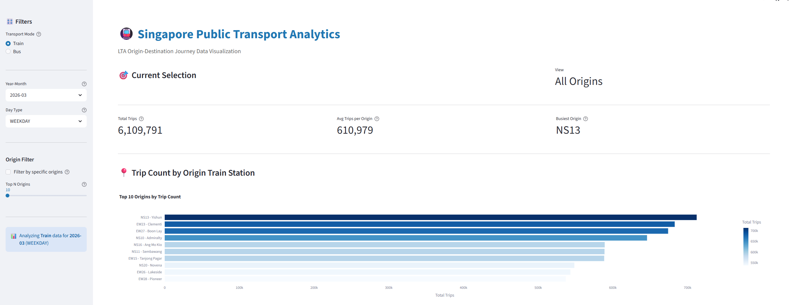
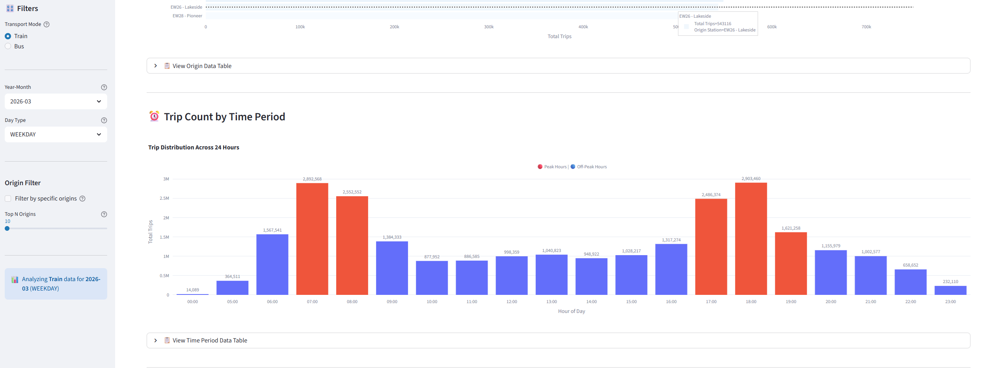

# Singapore LTA Public Transport Analytics Pipeline

End-to-end data pipeline for analyzing Singapore's public transport demand patterns using LTA (Land Transport Authority) data.

**Data Engineering Zoomcamp 2026 - Capstone Project**

**Project Owner:** Joseph Emmanuel Remoto (josephemmremoto@gmail.com)

---

## Overview

This pipeline extracts train and bus journey data from Singapore's Land Transport Authority API, processes it through Google Cloud Platform (BigQuery, GCS), transforms it with dbt, and visualizes insights through an interactive Streamlit dashboard.

**Tech Stack:** Python, GCP (BigQuery, GCS), dbt, Terraform, Docker, Apache Airflow, Streamlit

---

## Problem Statement

### The Challenge

Singapore's Land Transport Authority (LTA) publishes comprehensive public transport usage data through their DataMall API, providing detailed origin-destination (OD) journey patterns for buses and trains. However, this data exists in:

- **Fragmented monthly datasets** - Each month released separately, requiring aggregation
- **Raw API format** - Not optimized for analytical queries or visualization
- **Large volumes** - Millions of journey records requiring efficient processing
- **Complex relationships** - Journey data needs to be linked with reference data (bus stops, train stations)

### Business Value

Understanding public transport demand patterns enables:

1. **Urban Planning** - Identify high-traffic routes and underserved areas
2. **Infrastructure Investment** - Data-driven decisions for expanding capacity
3. **Service Optimization** - Adjust schedules based on actual usage patterns
4. **Demand Forecasting** - Predict future transport needs across different time periods
5. **Policy Making** - Evaluate impact of transport policies on ridership

### Solution

This project builds an automated, scalable data pipeline that:

- **Extracts** monthly OD data from LTA DataMall API
- **Stores** raw data in cloud storage with proper versioning
- **Transforms** data into a star schema optimized for analytics
- **Visualizes** key metrics through interactive dashboards
- **Orchestrates** the entire pipeline for hands-free monthly updates

### Key Insights Generated

The dashboard reveals:

- **Top transport origins** by trip volume (identifying major commuter hubs)
- **Temporal patterns** showing peak hours, weekday vs weekend trends
- **Mode preferences** comparing bus vs train usage patterns
- **Network connectivity** understanding how different stations/stops are connected

---

## Features

- **Automated Data Extraction:** Monthly bus and train origin-destination (OD) data from LTA DataMall API
- **Cloud Infrastructure:** GCP resources managed with Terraform (BigQuery datasets, GCS buckets, IAM)
- **Data Transformation:** dbt models for cleaning, joining, and creating analytics-ready tables
- **Orchestration:** Apache Airflow DAGs for automated monthly pipeline execution
- **Interactive Dashboard:** Streamlit app with trip count visualizations and filters
- **Data Quality:** Built-in dbt tests and validation checks

---

## Quick Start

Choose your path:

- **Fast Setup (15 min):** [`docs/QUICKSTART.md`](docs/QUICKSTART.md) - Get dashboard running quickly
- **Full Setup (1-2 hours):** [`docs/SETUP-GUIDE.md`](docs/SETUP-GUIDE.md) - Complete step-by-step guide for new machines

### Prerequisites

- Python 3.10+
- Google Cloud account with billing enabled
- LTA DataMall API key (free registration)

### 5-Minute Demo

```bash
# Clone repository
git clone https://github.com/YOUR_USERNAME/sg_public_transport_pipeline.git
cd sg_public_transport_pipeline

# Setup virtual environment
python -m venv .venv
source .venv/bin/activate  # Mac/Linux: .\.venv\Scripts\Activate.ps1 on Windows

# Install dependencies
pip install -e .

# Configure (see SETUP-GUIDE.md for details)
# 1. Create GCP project and resources (terraform apply)
# 2. Setup credentials/gcp-service-account.json
# 3. Create .env file with GCP_PROJECT_ID and LTA_ACCOUNT_KEY

# Run dashboard
cd streamlit_app
pip install -r requirements.txt
streamlit run app.py
```

---

## Project Structure

```
sg_public_transport_pipeline/
├── .cursor/rules/          # Project conventions and coding standards
├── airflow/                # Airflow DAGs and configuration
│   ├── dags/              # Pipeline orchestration DAGs
│   └── config/            # Airflow profiles.yml
├── credentials/           # GCP service account keys (git-ignored)
├── data/                  # Local data cache (git-ignored)
│   ├── raw/              # Extracted JSON files
│   └── processed/        # Transformed NDJSON files
├── docs/                  # Comprehensive documentation
│   ├── SETUP-GUIDE.md    # Complete setup instructions
│   ├── QUICKSTART.md     # Fast-track setup
│   ├── architecture.md   # System design and data flow
│   └── current-status.md # Project progress and phase details
├── scripts/               # Utility scripts
│   ├── upload_to_gcs.py  # GCS upload automation
│   └── load_to_bq.py     # BigQuery loading
├── sg_transport_dbt/      # dbt transformation project
│   ├── models/
│   │   ├── staging/      # Raw data cleaning
│   │   └── marts/        # Analytics tables
│   └── tests/            # Data quality tests
├── src/                   # Python source code
│   ├── ingestion/        # API extraction modules
│   └── upload/           # GCS upload modules
├── streamlit_app/         # Interactive dashboard
│   ├── app.py            # Main dashboard
│   ├── utils/            # BigQuery client
│   └── requirements.txt
├── terraform/             # Infrastructure as Code
│   ├── main.tf           # GCP resource definitions
│   └── variables.tf
├── .env                   # Environment variables (git-ignored)
├── docker-compose.yml     # Airflow services
├── Dockerfile             # Custom Airflow image
└── pyproject.toml         # Python project config
```

---

## Pipeline Architecture

```
LTA API → Python Extraction → GCS (Raw) → BigQuery (Staging)
    ↓                                              ↓
dbt Transformation ← BigQuery ← Data Quality Tests
    ↓
BigQuery (Marts) → Streamlit Dashboard
    ↑
Apache Airflow (Orchestration)
```

**Detailed architecture:** [`docs/architecture.md`](docs/architecture.md)

---

## Data Sources

**Singapore Land Transport Authority (LTA) DataMall:**
- Bus origin-destination (OD) journeys
- Train origin-destination (OD) journeys
- Bus stop reference data
- Train station reference data

**API Documentation:** https://datamall.lta.gov.sg/content/datamall/en/dynamic-data.html

---

## Project Phases

| Phase | Description | Status |
|-------|-------------|--------|
| Phase 1 | Data Extraction (Python) | ✅ Complete |
| Phase 2 | Infrastructure (Terraform) | ✅ Complete |
| Phase 3 | Data Upload (GCS) | ✅ Complete |
| Phase 4 | Data Loading (BigQuery) | ✅ Complete |
| Phase 5 | Transformation (dbt) | ✅ Complete |
| Phase 6 | Orchestration (Airflow) | ✅ Complete |
| Phase 7 | Visualization (Streamlit) | ✅ Complete |

**All phases complete! 🎉**

**Detailed status:** [`docs/current-status.md`](docs/current-status.md)

---

## Dashboard

### Live Demo

**Access the live dashboard:** [https://sg-public-transport-pipeline.streamlit.app/](https://sg-public-transport-pipeline.streamlit.app/)

The interactive Streamlit dashboard visualizes key transport metrics with dynamic filtering capabilities.

### Dashboard Features

- **Trip Count by Origin** - Bar chart showing top origins by trip volume
- **Trip Count by Time Period** - Distribution of trips across 24-hour periods (peak hours analysis)
- **Interactive Filters:**
  - Year-Month selector
  - Day type (Weekday/Weekend)
  - Transport mode (Bus/Train)
  - Origin station/stop filter
- **Real-time Metrics** - Total trips, number of origins, and time period with most trips
- **BigQuery Integration** - Direct queries to optimized data warehouse tables

### Visualizations

#### 1. Trip Count by Origin Train Station



Shows the top origins by trip volume, helping identify major commuter hubs like Yoshun, Clementi, Boon Lay.

#### 2. Trip Count by Time Period



Displays trip distribution across 24-hour periods, clearly showing morning (7-9 AM) and evening (5-8 PM) peak hours, with distinct weekday vs weekend patterns.

### Technical Implementation

- **Framework:** Streamlit 1.41.1
- **Visualization:** Plotly for interactive charts
- **Data Source:** BigQuery `fact_od_trips` table
- **Caching:** Query results cached for performance
- **Deployment:** Streamlit Cloud with automatic updates from main branch

---

## Data Warehouse Optimization

### Partitioning Strategy

**Table:** `fact_od_trips`  
**Partition Column:** `year_month` (STRING format: YYYYMM)

**Why this matters:**
- Queries typically filter by specific months (e.g., "show me January 2026 data")
- Partitioning by `year_month` ensures BigQuery only scans relevant partition
- **Cost savings:** Scanning 1 month vs entire table (12+ months) = 92% reduction in data scanned
- **Performance:** Sub-second query times instead of 5-10 seconds for full table scans

### Clustering Strategy

**Cluster Keys (in order):**
1. `transport_mode` (bus/train)
2. `origin_location_code`
3. `day_type` (Weekday/Weekend)

**Why this order:**
- Most queries filter by mode first ("show me train data")
- Then by specific origins ("from Jurong East station")
- Then by day type ("weekday patterns only")
- Clustering co-locates related data → faster queries and better compression

**Real-world impact:**
- Dashboard queries return in <2 seconds even with millions of rows
- Filter combinations are highly optimized (e.g., "train trips from Bedok on weekdays")
- Storage costs reduced through better compression (~30% smaller than unoptimized)

### Schema Design

**Star Schema** optimized for analytics:
- **Fact Table:** `fact_od_trips` (journey records with metrics)
- **Dimension Tables:** 
  - `dim_bus_stops` (bus stop details)
  - `dim_train_stations` (station details)
  - `dim_time_periods` (time period descriptions)

**Benefits:**
- Simple joins for dashboard queries
- Pre-aggregated metrics at fact table level
- Denormalized for query performance
- Easy to understand for business users

---

## Key Commands

### Data Extraction
```bash
# Extract reference data
python -m src.ingestion.extract_bus_stops
python -m src.ingestion.extract_train_stations

# Extract journey data (example: January 2026)
python -m src.ingestion.extract_bus_od --year 2026 --month 1
python -m src.ingestion.extract_train_od --year 2026 --month 1
```

### GCS Upload
```bash
python scripts/upload_to_gcs.py --reference-only
python scripts/upload_to_gcs.py --year 2026 --month 1
```

### BigQuery Load
```bash
python scripts/load_to_bq.py --reference
python scripts/load_to_bq.py --od
```

### dbt Transformation
```bash
cd sg_transport_dbt
dbt deps           # Install dependencies
dbt run            # Run transformations
dbt test           # Run data quality tests
dbt docs generate  # Generate documentation
dbt docs serve     # View docs at localhost:8080
```

### Streamlit Dashboard
```bash
cd streamlit_app
streamlit run app.py  # Opens at localhost:8501
```

### Airflow (Docker)
```bash
# Start Airflow
docker-compose up -d

# Access UI: http://localhost:8080
# Username: admin, Password: admin

# Stop Airflow
docker-compose down
```

---

## Documentation

| Document | Description |
|----------|-------------|
| [`SETUP-GUIDE.md`](docs/SETUP-GUIDE.md) | Complete setup instructions for new machines |
| [`QUICKSTART.md`](docs/QUICKSTART.md) | Fast-track setup for experienced users |
| [`architecture.md`](docs/architecture.md) | System design and data flow diagrams |
| [`current-status.md`](docs/current-status.md) | Project progress and phase details |

---

## Requirements

### Python Dependencies
```
google-cloud-storage==2.18.2
google-cloud-bigquery==3.28.0
dbt-core==1.9.0
dbt-bigquery==1.9.0
requests==2.32.3
pandas==2.2.3
streamlit==1.41.1
plotly==5.24.1
python-dotenv==1.0.1
```

### GCP Resources
- **BigQuery:** 1 dataset with staging and marts tables
- **Cloud Storage:** 2 buckets (raw + processed)
- **IAM:** Service account with BigQuery Admin and Storage Admin roles

### API Access
- **LTA DataMall:** Free account with API key

---

## Environment Variables

Required in `.env` file:

```bash
# GCP Configuration
GOOGLE_APPLICATION_CREDENTIALS=./credentials/gcp-service-account.json
GCP_PROJECT_ID=your-project-id
GCP_REGION=asia-east1

# GCS Buckets
GCS_BUCKET_RAW=your-bucket-raw
GCS_BUCKET_PROCESSED=your-bucket-processed

# BigQuery
BQ_DATASET=sg_public_transport_analytics
BQ_LOCATION=asia-east1

# LTA API
LTA_ACCOUNT_KEY=your-lta-api-key
```

See [`SETUP-GUIDE.md`](docs/SETUP-GUIDE.md) for detailed configuration steps.

---

## Testing

```bash
# Test API extraction
python -m src.ingestion.extract_bus_stops

# Test GCS upload
python scripts/upload_to_gcs.py --data-type reference

# Test BigQuery load
python scripts/load_to_bq.py --table-type reference

# Test dbt
cd sg_transport_dbt
dbt debug  # Test connection
dbt run --select stg_bus_stops  # Test single model
dbt test   # Run all tests

# Test Streamlit
cd streamlit_app
streamlit run app.py
```

---

## Troubleshooting

### Common Issues

**1. Credentials not found**
```bash
# Use absolute path in .env
export GOOGLE_APPLICATION_CREDENTIALS="/full/path/to/credentials/gcp-service-account.json"
```

**2. BigQuery permission denied**
```bash
# Grant roles to service account
gcloud projects add-iam-policy-binding YOUR_PROJECT_ID \
  --member="serviceAccount:YOUR_SERVICE_ACCOUNT@YOUR_PROJECT.iam.gserviceaccount.com" \
  --role="roles/bigquery.admin"
```

**3. LTA API 401 error**
- Verify API key in `.env`
- Check key is active in LTA DataMall account
- Ensure no extra spaces/quotes in `.env`

**4. dbt connection fails**
- Check `~/.dbt/profiles.yml` has absolute path to keyfile
- Run `dbt debug` to diagnose
- Verify service account has BigQuery permissions

**Full troubleshooting guide:** [`SETUP-GUIDE.md#troubleshooting`](docs/SETUP-GUIDE.md#troubleshooting)

---

## Performance

- **Data Extraction:** ~10-15 min per month (bus + train)
- **GCS Upload:** ~1-2 min per month
- **BigQuery Load:** ~2-3 min per month
- **dbt Transformation:** ~3-5 min full run
- **Airflow DAG:** ~20-30 min end-to-end
- **Streamlit Dashboard:** <2 sec load time (with caching)

---

## Contributing

This is a personal capstone project, but feedback and suggestions are welcome!

1. Fork the repository
2. Create a feature branch
3. Follow existing code conventions (see `.cursor/rules/`)
4. Test changes locally
5. Submit a pull request

---

## License

This project is for educational purposes as part of the Data Engineering Zoomcamp 2026.

---

## Acknowledgments

- **Data Engineering Zoomcamp 2026** - Course structure and guidance
- **Singapore LTA** - Public transport data via DataMall API
- **DataTalks.Club** - Data engineering community

---

## Contact

**Project Owner:** Joseph Emmanuel Remoto  
**Email:** josephemmremoto@gmail.com

For questions or collaboration:
- GitHub Issues: [Create an issue](https://github.com/YOUR_USERNAME/sg_public_transport_pipeline/issues)
- Data Engineering Zoomcamp 2026: [Course Repository](https://github.com/DataTalksClub/data-engineering-zoomcamp)

---

**Status:** All phases complete ✅  
**Last Updated:** April 17, 2026  
**Version:** 1.0
